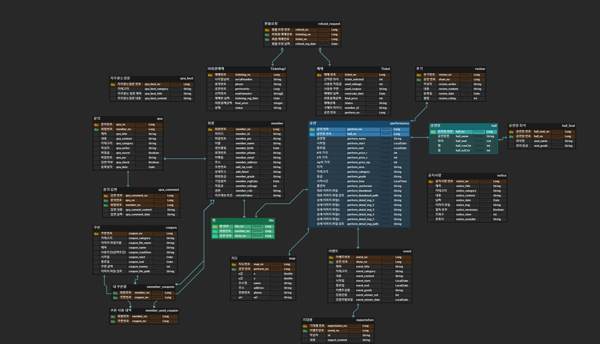

<h1>🎫Tissue : 공연 예매 사이트</h1>
<h2>1. 프로젝트 소개</h2>
<h4>개발 목표</h4>
<ul>
  <li>yes 24 티켓을 클론코딩하자</li>
  <li>세련된 UI로 깔끔하고 편리한 서비스를 제공하자</li>
  <li>정확하고 에러없는 서비스를 만들자</li>
 </ul>
 <h4>개발 기간</h4>
 <ul>
   <li>2022.05.31 ~ 2022.07.12</li>
 </ul>
 <h2>2. 개발 환경</h2>
 <h4>BackEnd</h4>
 <ul>
   <li>
      
  </li>
  <li>
      
      
      
      
      </li>
   <li></li>
  
  </ul>
  <h4>Frontend</h4>
  <ul>
    <li>
        
        </li>
    <li></li>
    <li>
        </li>

  </ul>
<h4>DB</h4>
<ul>
    <li>
        
    </li>
</ul>
<h4>협업</h4>
<ul>
    <li>
        
  </li>
  <li>
        
           
  </li>
  <li>
        
    </li>
</ul>
<h2>3. DB 설계</h2>
  
  
<h2>4. 페이지 기능</h2>
  <h4>:one: QnA 시스템</h4>
  
  <h4>:two: 랭킹 시스템</h4>
  
  <h4>:three: 공지사항 시스템</
    
